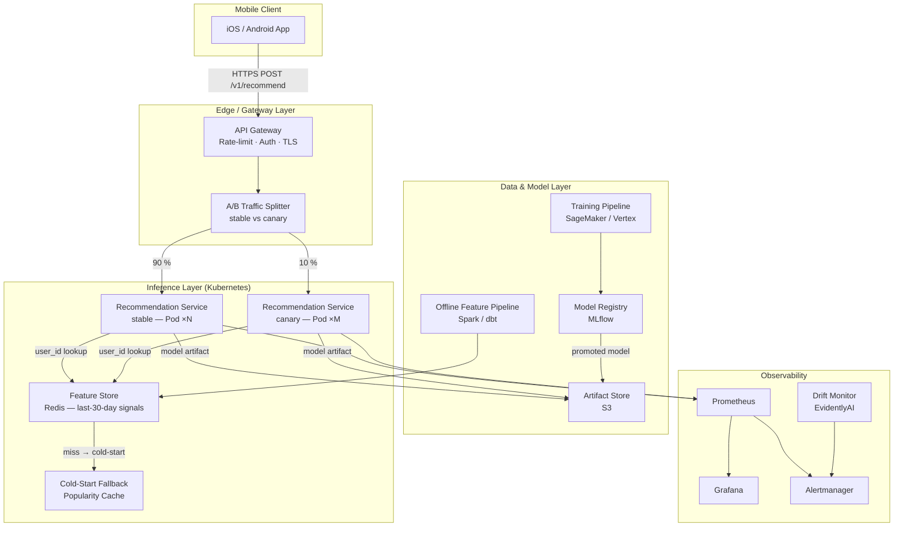

# MLOps Dossier — Personalized In-App Recommendations (Scenario X)

## Executive Summary

This system delivers real-time personalized product recommendations for a B2C mobile retail
application. On every home-screen load, the service returns a ranked top-K product list derived
from the user's last 30 days of browsing and purchase history. Cold-start users (no history)
receive popularity-based fallback recommendations without any degraded experience. A/B experiments
run continuously against the model; traffic splitting is handled at the inference gateway so no
client-side changes are needed per experiment. The system sustains **~800 RPS** at peak, targets
**p95 ≤ 120 ms** end-to-end, auto-scales on Kubernetes, and requires human sign-off before every
model promotion to production.

---

## Architecture Diagram

---

## Key Numbers

| Parameter | Value | Source |
|---|---|---|
| Peak RPS | 800 req/s | Scenario definition |
| p95 Latency budget | 120 ms e2e | Scenario definition |
| p99 Latency target | 200 ms | Buffered |
| Availability SLO | 99.9 % (43.8 min/month) | `serving/slos.yaml` |
| Model size (baked) | ~400 MB | Two-tower embedding model |
| Initial replica count | 12 pods | `serving/capacity-plan.md` |
| Hardware per pod | 4× vCPU, 8 GB RAM | AWS c6i.xlarge |
| Monthly cost estimate | ~$3,000 (AWS EKS) | Capacity plan breakdown |
| Feature Store | Redis Cluster, 3 nodes | Sub-millisecond lookup |
| Cold-Start Fallback | Popularity Cache (Redis) | Hourly refresh |

---

## Navigation

| Path | Contents |
|---|---|
| [`architecture/architecture.md`](architecture/architecture.md) | Full architecture diagram and layer explanations |
| [`architecture/JUSTIFICATION.md`](architecture/JUSTIFICATION.md) | Pattern choices and trade-off analysis |
| [`architecture/adr/0001-two-tower-model.md`](architecture/adr/0001-two-tower-model.md) | ADR: Two-Tower vs alternatives |
| [`architecture/adr/0002-bake-vs-mount.md`](architecture/adr/0002-bake-vs-mount.md) | ADR: Model artifact bake-in vs runtime mount |
| [`lifecycle/lifecycle.md`](lifecycle/lifecycle.md) | End-to-end model lifecycle diagram |
| [`lifecycle/model-registry.yaml`](lifecycle/model-registry.yaml) | Registry spec (metadata, gates, lineage) |
| [`container/Dockerfile`](container/Dockerfile) | Multi-stage, slim, secure image |
| [`container/README.md`](container/README.md) | Image plan: bake/mount decision, base, size estimate |
| [`api/openapi.yaml`](api/openapi.yaml) | Full OpenAPI 3.1 specification |
| [`api/examples/`](api/examples/) | Sample request/response payloads |
| [`serving/capacity-plan.md`](serving/capacity-plan.md) | Replica math, hardware selection |
| [`serving/slos.yaml`](serving/slos.yaml) | SLO objectives (availability, latency) |
| [`serving/load-test-plan.md`](serving/load-test-plan.md) | k6 load test plan |
| [`cicd/.github/workflows/deploy-model.yml`](cicd/.github/workflows/deploy-model.yml) | CI/CD pipeline |
| [`monitoring/alerts.yaml`](monitoring/alerts.yaml) | Multi-window burn-rate + drift alerts |
| [`runbooks/rollback.md`](runbooks/rollback.md) | Rollback runbook (checklist format) |

---

## Open Questions

Three items that need clarification before building starts on Monday:

1. **Feature Store ownership** — Do the last-30-day browsing/purchase signals already exist in a
   centralized store, or do we need to co-design a new pipeline with Data Engineering? This
   directly affects the MVP launch date.

2. **A/B experiment ownership** — Does traffic splitting live at the inference gateway (our
   preferred approach) or in the mobile client? Gateway-side splitting is more reliable but
   requires the experiment metadata to be forwarded in the response header so the analytics team
   can log it correctly.

3. **Cold-start definition** — Does "no history" mean only brand-new registrations, or does it
   also include users whose last 30-day window is empty (dormant accounts)? This changes the
   complexity of the fallback model.
