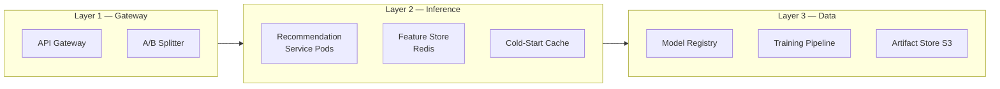

# Architecture — Personalized Recommendations

## Overall Approach: Gateway → Inference → Feature Store

The architecture is divided into three primary layers. The reason for this separation is that each
layer has its own scaling behavior, latency profile, and responsibility. Merging them would allow
a problem in one layer to cascade and take down the others.

---

## Layer 1 — Gateway (API Gateway + A/B Splitter)

### What it does
- Accepts all inbound HTTPS traffic
- Enforces rate-limiting, JWT authentication, TLS termination
- Routes a configurable percentage of traffic (e.g. 90/10) to stable vs canary deployments

### Why it is a separate layer
At 800 RPS, only the gateway sees every request — inference pods only see the traffic that
passes through. Embedding authentication logic inside inference code makes it heavier, slower,
and harder to test independently.

### Why A/B splitting lives here
Client-side splitting is unreliable: mobile apps cache aggressively and lag on version adoption.
Gateway-side splitting:
- Guarantees precise 90/10 traffic allocation
- Attaches the `X-Experiment-ID` header to every response for analytics logging
- Allows new model rollouts without shipping a new app release

---

## Layer 2 — Inference Pods

### What it does
- Fetches the user's feature vector from the Feature Store (Redis, <5 ms)
- Runs the Two-Tower user tower to produce an embedding (CPU)
- Searches pre-computed item embeddings using FAISS ANN to produce top-K results

### Why CPU, not GPU
At inference time the Two-Tower model only runs the user tower forward pass and performs an
Approximate Nearest Neighbor search against pre-computed item embeddings. This computation is
lightweight enough that GPU is not required. CPU inference is 3× cheaper, auto-scales faster
(no GPU node warm-up), and has no cold-start latency overhead.

### Why Redis for the Feature Store
The last-30-day signals are written hourly by the offline pipeline (Spark/dbt). At inference
time we only *read* them — we need sub-millisecond lookups. Redis is the standard choice for
this pattern.

### Cold-Start Fallback
When a `user_id` is not found in Redis, the service reads a separate Redis key containing the
top-selling/most-viewed products (refreshed hourly by an offline job). The response includes
`cold_start: true` so downstream analytics can distinguish the two populations.

---

## Layer 3 — Data & Model

### What it does
- The Training Pipeline trains a new model and registers it in MLflow
- The registry's `Production`-stage model points to an artifact in S3
- Inference pods load this artifact at startup (baked into the image per ADR-0002)

### Why MLflow Registry
- Model version, parameters, and metrics are stored together in one place
- `Staging → Production` transitions require a human approval gate (configurable)
- Every inference response carries `X-Model-Version`, which ties back to this registry version

---

## Latency Budget Breakdown

End-to-end p95 budget is 120 ms. Allocation:

| Component | Budget | Rationale |
|---|---|---|
| Network (client → gateway) | ~10 ms | Typical mobile network |
| Gateway (auth + routing) | ~5 ms | Lightweight JWT verification |
| Feature Store lookup (Redis) | ~5 ms | In-memory, same region |
| Model inference (CPU, ANN) | ~60 ms | Two-tower + FAISS IVF |
| Serialization + response write | ~10 ms | JSON encode, HTTP write |
| **Total (p50 target)** | **~90 ms** | 30 ms buffer for p95 variation |

The 30 ms buffer absorbs the p50→p95 spread. Even if the Feature Store reaches 20 ms at p99,
the overall budget is not breached.

---

## Scaling Strategy

- **HPA (Horizontal Pod Autoscaler)** — adds pods when CPU utilization exceeds 70 %
- **Startup Probe** — pods do not receive traffic until the model is fully loaded (~8 s)
- **PodDisruptionBudget** — at least 8 pods remain active during rolling updates
- **Gateway** — scales independently from inference pods

Rationale: 800 RPS peaks arrive suddenly (e.g. following a push notification). HPA reacts in
60–90 s. A minimum of 12 pods must be running at all times so that no single pod reaches 100 %
CPU before new pods come online.
